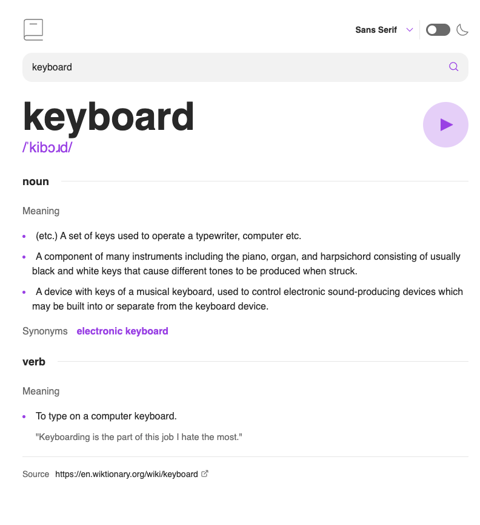
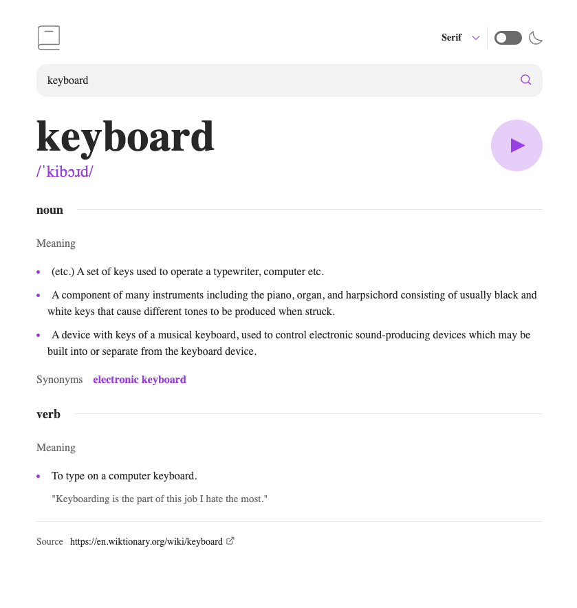
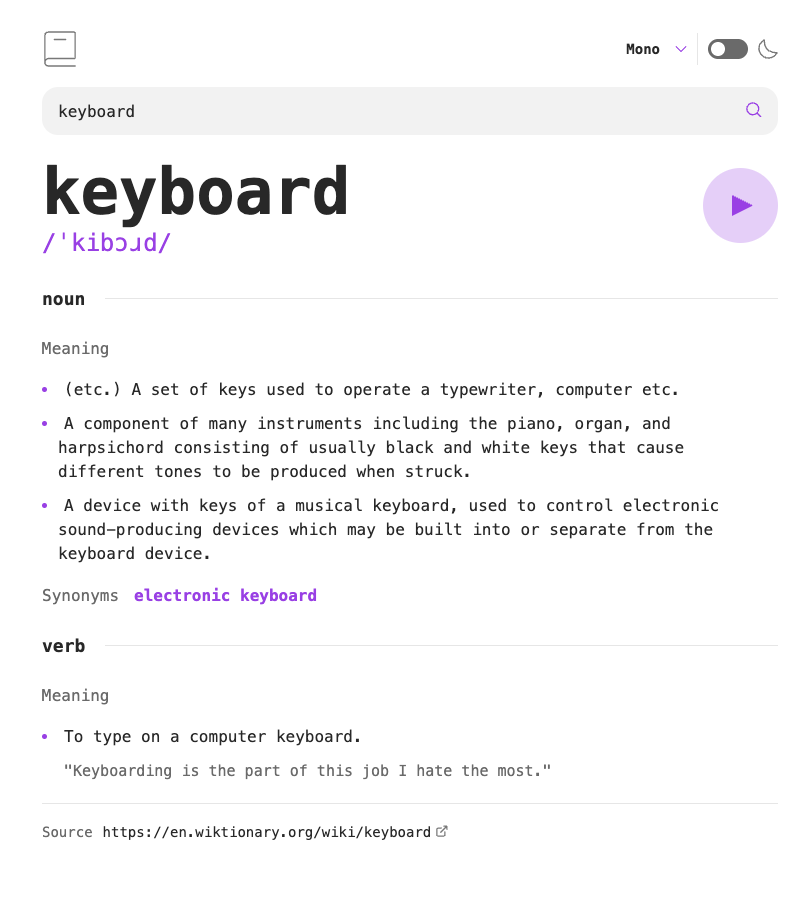
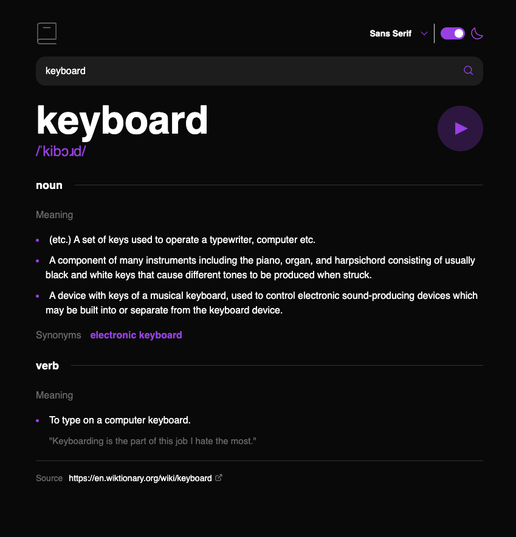

# Frontend Mentor - Dictionary web app solution

This is a solution to the [Dictionary web app challenge on Frontend Mentor](https://www.frontendmentor.io/challenges/dictionary-web-app-h5wwnyuKFL). Frontend Mentor challenges help you improve your coding skills by building realistic projects.

## Table of contents

- [Frontend Mentor - Dictionary web app solution](#frontend-mentor---dictionary-web-app-solution)
  - [Table of contents](#table-of-contents)
  - [Overview](#overview)
    - [The challenge](#the-challenge)
    - [Screenshot](#screenshot)
    - [Links](#links)
  - [My process](#my-process)
    - [Built with](#built-with)
  - [Author](#author)

## Overview

### The challenge

Users should be able to:

- Search for words using the input field
- See the Free Dictionary API's response for the searched word
- See a form validation message when trying to submit a blank form
- Play the audio file for a word when it's available
- Switch between serif, sans serif, and monospace fonts
- Switch between light and dark themes
- View the optimal layout for the interface depending on their device's screen size
- See hover and focus states for all interactive elements on the page

### Screenshot

Users can select different fonts:

Sans Serif:

Serif:

Monospace:

Users can toggle between light and dark mode:

Light Mode:

Dark Mode:

### Links

- Solution URL: [Repository Hosted on GitHub](https://github.com/ejparnell/dictionary-web-app)
- Live Site URL: [Deployed on Netlify](https://bp-dictionary-web-app.netlify.app/)

## My process

### Built with

- Semantic HTML5 markup
- Flexbox
- Mobile-first workflow
- CSS Modules
- [React](https://reactjs.org/) - JS library
- [Next.js](https://nextjs.org/) - React framework
- [TypeScript](https://www.typescriptlang.org/) - Typed superset of JavaScript

## Author

- Website - [Beth Parnell](https://www.your-site.com)
- LinkedIn - [@elizabethjparnell](https://www.linkedin.com/in/elizabethjparnell/)
